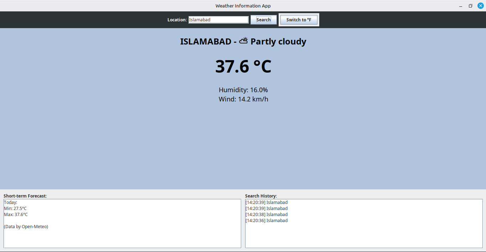

# Weather Information App

## Description
This Weather Information App is a Java Swing GUI application built using a structured MVC and Layered Architecture approach. It fetches and displays real-time weather data and short-term forecasts for any given location. The application integrates with the Open-Meteo API to retrieve weather information and presents it in a user-friendly interface. It includes features such as unit conversion, error handling, search history tracking, and dynamic backgrounds based on the time of day.



## Features Included
1. **API Integration**: Integrates with the open-source Open-Meteo API using standard Java networking (`HttpURLConnection`), without requiring external libraries.
2. **GUI Design**: Fully functional Java Swing interface with clear navigation, text inputs, buttons, and multiple panels.
3. **Display Weather Information**: Shows current temperature, humidity, wind speed, and weather conditions.
4. **Icon Representation**: Uses visual Unicode-based weather icons (e.g., ☀️, ⛅, 🌧️) as lightweight, dependency-free icons representing the condition.
5. **Forecast Display**: Includes a dedicated bottom panel (`ForecastPanel`) showing the day's min and max temperature forecasts.
6. **Unit Conversion**: Features a `SettingsPanel` with a toggle to switch between Celsius/Fahrenheit for temperature and km/h to mph for wind speed.
7. **Error Handling**: Implements custom exception classes (`ApiException`, `InvalidLocationException`) and displays UI warnings using `JOptionPane` if the location is invalid or the connection fails.
8. **History Tracking**: `SearchHistoryPanel` keeps a scrolling timestamped log of recent location searches.
9. **Dynamic Backgrounds**: `BackgroundManager` dynamically alters the display background based on the time of day (is_day) at the target location.

## Project Structure
The project is organized cleanly:
- `src/main/java/com/weatherapp/api/`: API integration and HTTP connections
- `src/main/java/com/weatherapp/model/`: Data structures
- `src/main/java/com/weatherapp/service/`: Business logic, unit conversion, dynamic background logic
- `src/main/java/com/weatherapp/ui/`: Java Swing Graphical User Interface classes
- `src/main/java/com/weatherapp/utils/`: Utilities like JSON parsing without external dependencies

## How to compile and run

### Using Maven:
Navigate to the root directory where `pom.xml` is located:
```bash
mvn clean compile
mvn exec:java -Dexec.mainClass="com.weatherapp.Main"
```

### Using standard `javac`:
```bash
# Compile all source files into an 'out' directory
javac -d out $(find src -name "*.java")

# Run the Main class
java -cp out com.weatherapp.Main
```
